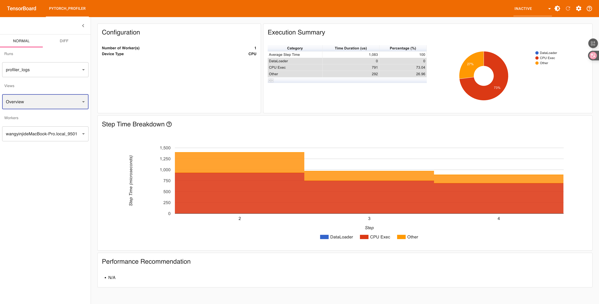
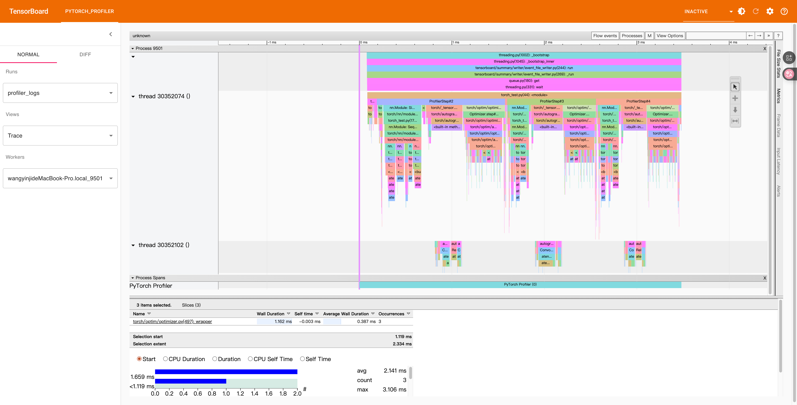
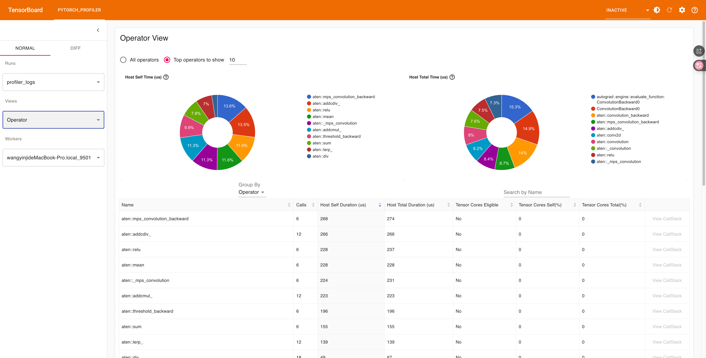

# 使用Pytorch.profiler + Tensorboard

## 1. Profile工具的作用
PyTorch 的 **Profiler** 是一个用于分析模型性能的工具。它能够帮助我们深入了解模型在训练或推理过程中各个阶段的执行时间和资源使用情况。通过 Profiler，我们可以找出模型运行中的性能瓶颈，优化算子实现、调度策略和数据管线，从而显著提升整体运行效率。

Profiler 的核心目标是让开发者知道 **“时间都花在了哪里”**。它能记录从 Python 层到底层算子的执行信息，包括前向传播、反向传播、优化器更新、数据加载等环节。借助这些信息，我们可以判断是否存在某个算子过慢、CPU 与 GPU/MPS 协同不理想、或者内存占用异常的问题。

Profiler 生成的数据可以通过 **TensorBoard** 进行可视化展示。TensorBoard 提供了时间线、算子耗时统计、内存使用曲线、调用堆栈等图形化视图，让性能分析过程更加直观。开发者可以交互式地浏览不同算子、函数和线程的执行顺序，发现瓶颈所在。

在模型开发的不同阶段，Profiler 都能发挥作用。
在模型原型阶段，它帮助快速评估不同结构的计算复杂度。
在训练优化阶段，它用于定位前向或反向传播中的性能瓶颈。
在部署阶段，它能验证编译后的模型在目标硬件上的执行效率。

通过合理地使用 PyTorch Profiler 与 TensorBoard，可将性能调优过程从经验驱动转变为数据驱动，为模型加速提供精确依据。

## 2. 示例程序
使用前需要配置好环境和库
```
$ pip install torch torchvision torchaudio
$ pip install tensorboard
```

```
import torch
import torch.nn as nn
import torch.profiler
from torch.utils.tensorboard import SummaryWriter

class SimpleNet(nn.Module):
    def __init__(self):
        super().__init__()
        self.seq = nn.Sequential(
            nn.Conv2d(3, 16, 3, padding=1),
            nn.ReLU(),
            nn.Conv2d(16, 32, 3, padding=1),
            nn.ReLU(),
            nn.AdaptiveAvgPool2d(1)
        )

    def forward(self, x):
        return self.seq(x)

device = torch.device("mps" if torch.backends.mps.is_available() else "cpu")
model = SimpleNet().to(device)
x = torch.randn(8, 3, 224, 224).to(device)
optimizer = torch.optim.Adam(model.parameters())

log_dir = "./profiler_logs"
writer = SummaryWriter(log_dir)

with torch.profiler.profile(
    activities=[
        torch.profiler.ProfilerActivity.CPU,
        # ⚠️ 去掉 MPS，因为 PyTorch 目前不支持
    ],
    schedule=torch.profiler.schedule(wait=1, warmup=1, active=3, repeat=1),
    on_trace_ready=torch.profiler.tensorboard_trace_handler(log_dir),
    record_shapes=True,
    with_stack=True
) as prof:
    for step in range(5):
        optimizer.zero_grad()
        y = model(x)
        loss = y.mean()
        loss.backward()
        optimizer.step()
        prof.step()

print("Profiler 数据已保存至:", log_dir)
```

```
$ tensorboard --logdir=./profiler_logs
$ http://localhost:6006 <-在浏览器中打开
```
## 3. 运行后内容展示

- Overivew


- Trace


- Module


- Operator


---

# 4. 相关文档
1. [使用 TensorBoard 的 PyTorch 分析器](https://docs.pytorch.org/tutorials/intermediate/tensorboard_profiler_tutorial.html)
2. [Ascend PyTorch Profiler接口采集](https://www.hiascend.com/document/detail/zh/CANNCommunityEdition/80RC2alpha002/devaids/auxiliarydevtool/atlasprofiling_16_0037.html)
3. [华为昇腾开发工具简介](https://www.hiascend.com/document/detail/zh/CANNCommunityEdition/80RC2alpha002/devaids/auxiliarydevtool/auxiliarydevtool_0000.html)


---

>**提交者：** Old\
> **更新日期:** 2025/11/5