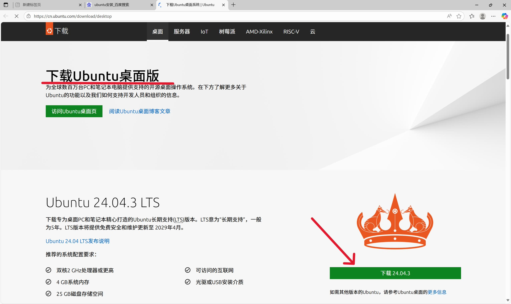
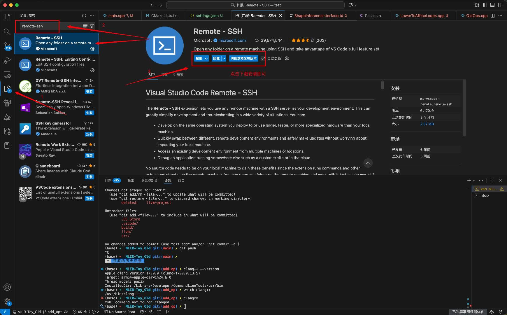
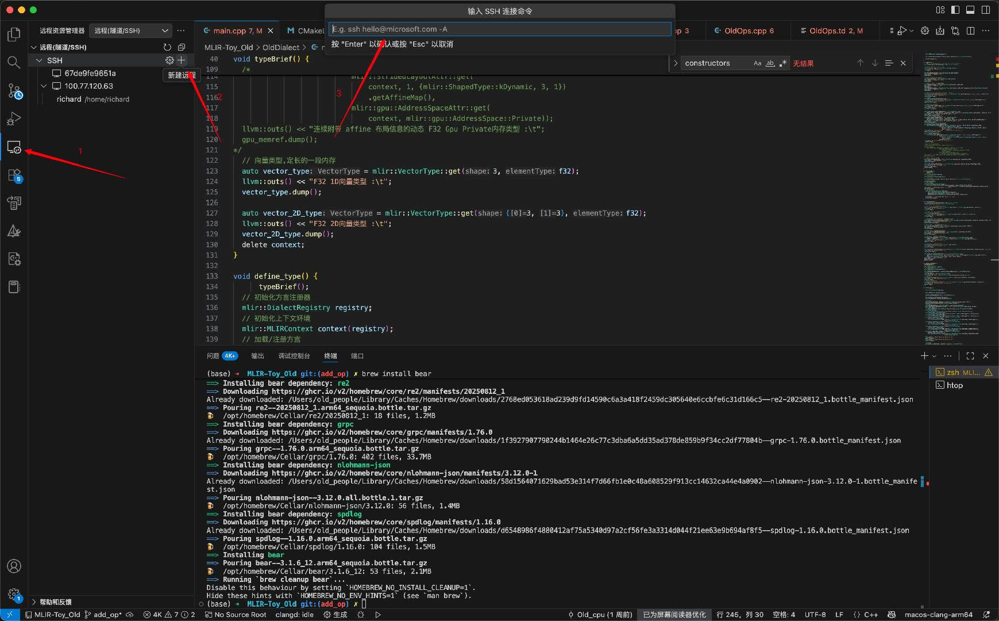
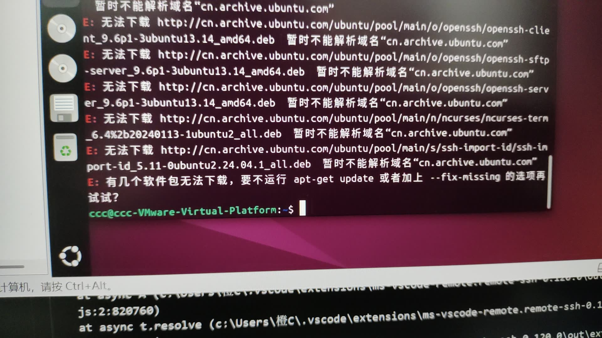
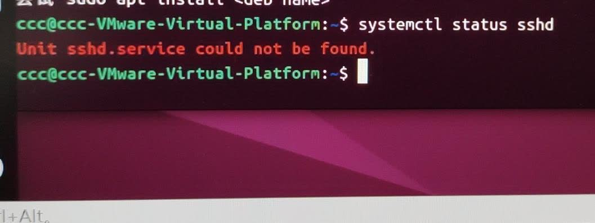
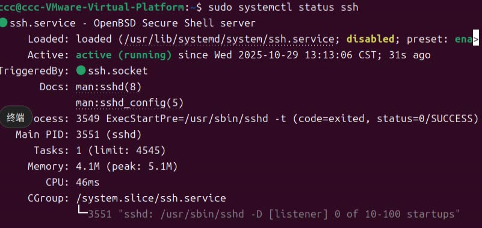

# Ubuntu使用指南

## Ubuntu的安装

- 搜索下载Ubuntu桌面版
  
  打开VMware--创建新的虚拟机名称--选择下载好的Ubuntu文件--创建虚拟机名称--按需选择最大磁盘大小
  以下为上面步骤完成后的操作流程
  <https://ubuntu.com/download/desktop/install-ubuntu-desktop>
  1.可以看图片操作，从第4步开始看(语言选择中文)，可以跳过第6步，看到第10步即可
  2.一直点击右下角的下一步即可
    

## 以下是用VScode连接ubuntu

- 第一步：下载ssh
  

- 第二步：新建--输入电脑IP--选择Linux
  

## 若出现无法连接的情况

1.先查看ubuntu上是否安装ssh

按Ctrl+Alt+T打开终端，依次执行以下命令

```
sudo apt update
sudo apt install openssh-server
```

若出现以下情况，则需要进行换源






以下以清华源为例

<https://mirrors.tuna.tsinghua.edu.cn/help/ubuntu/>

1. 备份原配置文件
   
   ```
   sudo cp /etc/apt/sources.list /etc/apt/sources.list.bak
   ```

2. 编辑新的源文件
   
   ```
   sudo vi /etc/apt/sources,list
   ```

3. 复制粘贴源文件

4. 按Esc键退出编辑模式

5. 输入 ：wq 并回车，即保存并退出

可以查看当前源文件

```
cat /etc/apt/sources.list
```

换源完成后可以安装ssh

```
sudo apt update
sudo apt install openssh-server
```

可以通过以下指令查看状态

```
sudo systemctl status ssh
```



此为连接成功


以下指令可以查看备份文件

```
cat /etc/apt/sources.list.bak
```

确认文件是否丢失

```
ls -l /etc/apt/ | grep<文件名>
#查看是否有相关文件
```

```
find /etc/apt/-name"sources.list*"
#搜索所有以sources.list开头的文件
```

## Ubuntu使用指南

#### 桌面环境入门：GNOME的基本操作

1. 顶部栏：屏幕顶部的栏
   
   - 活动：左上角或按 Super（Windows）键，可以显示所有窗口和程序坞。
   
   - 程序坞：屏幕左侧的快捷栏，可以固定常用应用。
   
   - 状态菜单：右上角，包含网络、声音、电池、用户和系统设置。

2. 工作区：GNOME 默认使用多工作区来管理窗口。在“活动”视图中，你可以将窗口拖到右侧的空白工作区，实现任务分离。

3. 基本快捷键
   
   * Win键：打开/关闭“活动”概述
   
   * Win + A：打开应用视图
   
   * Win + Tab：在运行的应用间切换
   
   * Alt + Tab：在相同工作区的窗口间切换
   
   * Ctrl + Alt + T：快速打开终端
   
   * Win + L：锁定屏幕

#### 软件管理：安装、更新和卸载

1. Ubuntu 软件中心（图形化，推荐新手）类似于手机的应用商店。你可以浏览、搜索和一键安装成千上万的免费软件。它还会自动处理更新。

2. APT 包管理器（命令行，最常用）这是 Ubuntu 软件管理的核心工具，功能强大。
   
   * 更新软件源列表：sudo apt update
   
   * 升级已安装的软件包：sudo apt upgrade
   
   * 安装一个软件：sudo apt install <软件包名>
   
   * 卸载一个软件：sudo apt remove <软件包名>
   
   * 搜索软件：apt search <关键词>

#### 终端与命令行

1. 基本命令
   
   * pwd：显示当前所在目录的路径
   
   * ls：列出当前目录下的文件和文件夹
   
   * cd <目录名>：切换目录。（cd .. 返回上一级；cd ~ 回到家目录）
   
   * cp <源文件> <目标位置>：复制文件
   
   * mv <源文件> <目标位置>：移动文件（也可用于重命名）
   
   * rm <文件名>：删除文件（小心使用，默认不进回收站）。rm -r <目录名> 删除目录
   
   * mkdir <目录名>：创建新目录
   
   * man <命令>：查看某个命令的详细手册（如 man ls）

2. 使用技巧
   
   * Tab 键自动补全：输入命令或文件名的一部分，按 Tab 键可以自动补全，避免输错
   
   * 上下箭头：快速调用之前执行过的命令
   
   * sudo：在命令前加上 sudo，表示以管理员权限执行该命令（需要输入你的密码）

#### 常见问题与技巧

* 如何安装 .deb 包？双击下载的 .deb 文件，它会在“软件中心”中打开并提示安装。或者使用命令行：sudo dpkg -i <文件名.deb>

* 如何解压 .tar.gz 或 .zip 文件？右键点击文件，通常会有“解压缩到此处”的选项。命令行使用 tar -xzf <文件名.tar.gz> 或 unzip <文件名.zip>

* 如何访问 Windows 分区或 U 盘？插入 U 盘或启动到 Ubuntu 后，它们通常会自动挂载并出现在左侧程序坞或“文件”应用中

* 如何解决依赖问题？在安装软件时如果遇到依赖错误，可以运行 sudo apt --fix-broken install 来尝试修复

* 忘记密码怎么办？这是一个比较进阶的操作，需要进入恢复模式重置 root 密码，然后修改用户密码。建议新手通过搜索引擎查找详细步骤。

总结：
===

1. .图形界面操作与终端命令相结合；使用“软件”应用或sudo apt install 命令来安装和管理软件。
2. 熟练使用基础终端命令（如ls, cd, sudo）和包管理器 (apt update && apt upgrade)是高效使用Ubuntu的关键。
3. 定期更新系统，并通过“快照”功能备份虚拟机状态，以便在出现问题时快速恢复。
   
   

    简单来说：熟悉图形界面，掌握终端基础命令和apt软件安装，并养成定期更新和备份的好习惯，就能轻松上手Ubuntu。

### 
